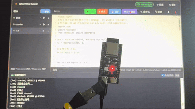
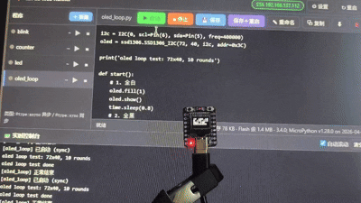
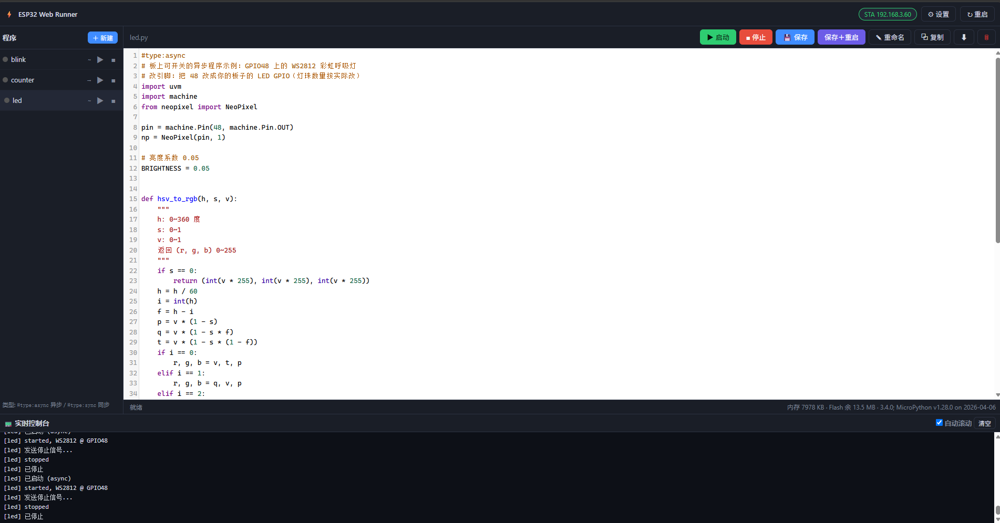

# ESP32 MPY Web Runner v2.2.1

**[中文](README.md) | English**

[](https://opensource.org/licenses/Apache-2.0)

**ESP32 MPY Web Runner** is a lightweight Web IDE that runs on the ESP32. It lets you write, run and manage
multiple MicroPython programs from your browser — no PC software to install, plug in and go.

Supports **ESP32-S3** and **ESP32-C3** targets sharing the same `lib/` and `programs/` code, with
board-level differences handled in the `targets/` directory (the C3 uses its own inline single-request
page, see the porting guide).

## Supported targets

| Target | Chip | Network mode | Display | Notes |
|---|---|---|---|---|
| `esp32s3` | ESP32-S3 (N16R8) | AP + STA dual mode | none | Full features, can host its own hotspot |
| `esp32c3` | ESP32-C3 | STA only (no AP) | OLED (SSD1306) | Saves memory, OLED shows IP/memory/status |

> **C3 vs S3**: the C3 does not broadcast an AP hotspot; it connects to your home router in STA mode
> and is reached through the router. This removes the AP + DHCP server memory overhead, so the
> 400KB-SRAM C3 can run the full Web IDE stably. The C3 also shows its IP address live on the OLED
> screen for easy browser access.
> To protect the single-core C3's lwIP buffers, the backend **caps concurrent connections
> at 3** and closes any excess connection immediately (the browser fetch fails silently);
> the S3 has no such limit.

> Technical details about the ESP32-C3 port and its memory constraints can be found in
> [docs/C3_PORTING_GUIDE.md](docs/C3_PORTING_GUIDE.md).
> (C3's no-PSRAM memory architecture differences, the GC split-heap root cause and the required module load order).

> The API contract (REST API / WebSocket / file sharded read-write protocol) is documented in
> [docs/API.md](docs/API.md).

## Features

- 📁 **Program management**: list, create, delete, rename, duplicate, download, import (upload files straight from the web page)
- 🗂 **File manager (new in v2.2)**: a separate entry that browses/edits the device's **whole filesystem** (`lib/`, `www/`, `programs/`, `config.json`, `main.py`/`boot.py`) like a file manager — create files/folders, rename, delete, upload, and download to your PC. Boot-critical files (`main.py`/`boot.py`/`config.json`/`lib/`/`www/`) get **red strong warnings + double confirmation** (delete/rename require `force`).
- 🔄 **Remote update (new in v2.2)**: on the "Update" tab, pick a local folder (or multiple files) and **batch-upload/overwrite** the app-layer code (new `lib/`, `www/`) preserving relative paths, with progress, a result summary and a "reboot to apply" button. Large files stream to flash (memory-safe on the C3); the file-manager editor reads/writes large files in **8KB shards** (limit C3 256KB / S3 512KB); files above the limit should be modified via "download + re-upload".
- ⌨️ **In-browser coding**: CodeMirror editor (Python syntax highlighting / auto-indent / bracket matching / autocomplete), Ctrl+S to save
- ▶️ **Start / stop**: async programs can be stopped at any time; sync scripts run in a thread so the web page is never blocked
- 📟 **Live console**: WebSocket pushes program `print` output to the page in real time
- 🌐 **Networking**:
  - S3: AP+STA dual mode (connects to your router if available, otherwise hosts a `ESP32-S3` hotspot at `192.168.4.1`)
  - C3: STA-only mode, reached through your router, IP shown on the OLED
- ⚙️ **Settings**: configure WiFi / hotspot / optional access password / auto-start on boot from the web page
- 🛡 **Watchdog**: automatically reboots the system if a program locks it up (S3; removed on the C3 for debugging convenience, see the porting guide)
- 🧠 **Chip auto-adaptation**: detects the chip at runtime; the S3 keeps high performance (500-line log / 2000-item queue), the C3 degrades automatically (150-line / 300-item queue) to save memory

## Screenshots

### ESP32-S3 (RGB LED control demo)


### ESP32-C3 (OLED status screen demo)


### ESP32-S3 (CodeMirror web IDE)



## File layout

```
├── lib/                        # Shared libraries (S3/C3 common, maintained once)
│   ├── config.py               # Config + chip detection + dynamic resource params
│   ├── console.py              # Global console (captures print output)
│   ├── fsmgr.py                # Filesystem manager (file manager / remote update, v2.2)
│   ├── net.py                  # Networking (AP+STA, AP enabled per ap.enabled)
│   ├── runner.py               # Program manager (async tasks + thread sync scripts)
│   ├── uvm.py                  # Helper library importable inside user programs
│   ├── web.py                  # microdot routes / REST API / WebSocket
│   ├── ssd1306.py              # OLED driver (used by C3)
│   └── microdot/               # Third-party zero-dependency web framework
├── www/                        # Multi-file web frontend (S3, stored in flash)
│   ├── index.html
│   ├── app.js
│   ├── style.css
│   └── cm/                     # CodeMirror editor (gzip shards on C3)
├── programs/
│   └── examples/               # Shared example programs
├── targets/                    # Board-level differences
│   ├── esp32s3/                # ESP32-S3 target
│   │   ├── main.py
│   │   └── boot.py
│   └── esp32c3/                # ESP32-C3 target
│       ├── main.py             # Thin bootloader (connect WiFi → fixed import order → c3_app)
│       ├── c3_app.py           # App logic (OLED / STA maintenance / Web startup)
│       ├── boot.py
│       ├── c3_config.py        # C3 config (WiFi / OLED pins / port)
│      ├── www/index.html      # C3 inline single-request page (generated by build_inline.py)
│      ├── www/cm/             # CodeMirror gzip shards cm-part0..7.js.gz (generated by build_cm.py)
│       └── examples/
│           └── oled_loop.py    # C3-specific OLED example
├── docs/
│   └── C3_PORTING_GUIDE.md     # C3 port technical notes (memory root cause & module load order)
└── tools/
    ├── upload.py               # One-shot upload (--target selects the board)
    ├── build_inline.py         # Builds the C3 inline single-request page (doesn't touch CM shards)
    ├── build_cm.py             # Builds C3 CodeMirror gzip shards (rerun only when CM sources change)
    └── smoke_test.py           # PC-side smoke test (no board required)
```

## Install / Upload

### 1. Install the upload tool (once)

```
pip install mpremote
```

### 2. Flash the firmware (if the board doesn't have MicroPython yet)

Firmware files in the repository root:

- `ESP32_GENERIC_S3-SPIRAM_OCT-20260406-v1.28.0.bin` — ESP32-S3 Octal-SPIRAM (N16R8)
- `ESP32_GENERIC_C3-20260406-v1.28.0.bin` — ESP32-C3

Flash the matching firmware with esptool.

### 3. Configure and upload

**ESP32-S3** (default target):

```
python tools/upload.py --target esp32s3
```

**ESP32-C3**:

First edit `targets/esp32c3/c3_config.py` and fill in your WiFi and OLED pins:

```python
WIFI_SSID = "your-wifi-ssid"
WIFI_PASS = "your-wifi-password"

# OLED 0.42" SSD1306 72x40
OLED_WIDTH = 72
OLED_HEIGHT = 40
OLED_SCL = 6
OLED_SDA = 5
OLED_ADDR = 0x3C

SERVER_PORT = 80
```

Then upload:

```
python tools/upload.py --target esp32c3
```

> The upload script will:
> - Upload the shared `lib/` and `programs/` to the board
> - Trim microdot per target (C3 skips cors/test_client to save flash)
> - Upload the `main.py` / `boot.py` from the matching `targets/<target>/`
> - Pre-write `config.json` (for C3, sets `ap.enabled=false` and pre-fills WiFi)
> - For C3, additionally upload `c3_config.py`, the C3-specific example and the **inline single-request page**
>   (only `index.html` is uploaded for `www/`; the CodeMirror bundle is pre-split
>   into 8 ~9KB gzip shards `cm/cm-part0..7.js.gz`, fetched sequentially by the
>   frontend, to avoid stalling on the C3's weak RF link)

### 4. Access

- **S3**: after power-on, connect to the `ESP32-S3` hotspot and visit `http://192.168.4.1`, or connect to your router and visit `http://<board-ip>`
- **C3**: after it joins your router, the OLED shows the IP address; browse to `http://<C3-IP>`

## The C3 OLED screen

The C3 OLED shows status in real time:

```
Connecting:                        Connected:
┌──────────┐                 ┌──────────┐
│Connecting│                 │IP 192.16 │
│your-ssid │                 │8.1.23    │
│Mem 156K  │                 │Mem 156K  │
│          │                 │SSID On   │
└──────────┘                 └──────────┘
```

- **Connecting**: shows `Connecting` + SSID + memory
- **Connected**: shows `IP` (split over two lines) + memory + `SSID On`

## How to use

- **New**: click "＋ New", pick the async or sync template, give it a name.
- **Coding**: click a program on the left, edit on the right. `Ctrl+S` saves; "Save & Restart" restarts that program automatically.
- **Choosing the type**:
  - A first-line comment `#type:async` / `#type:sync` forces the type;
  - otherwise code containing `async def main` is treated as async, everything else as sync.
  - Async program = asyncio task, the "Stop" button stops it immediately.
  - Sync script = runs in a dedicated thread, "Stop" is a cooperative signal (the script reads `uvm.should_stop()` in its loop).
    A stubborn infinite loop can't be hard-killed; the S3 is covered by the watchdog, the C3 needs a power cycle; at most 2 sync programs run concurrently.
- **What you can import**: `uvm` (helper library). For long-running loops see
  ```
  import uvm
  async def main():                # async program entry point
      while not uvm.should_stop():
          ...
          await uvm.sleep_ms(500)
  ```
  Sync scripts just run top to bottom; `uvm.sleep_ms(500)` blocks and delays.

## FAQ

| Symptom | Fix |
|---|---|
| Slow upload (S3) | CodeMirror files are large (~170KB); the first upload takes about half a minute, which is normal; the C3 uses the inline page and uploads quickly |
| Blank homepage | Check the WebSocket log first; make sure the upload finished, then press EN to reboot |
| No response after upload | Try rebooting the board, or fully power-cycle it and wait a moment |
| Can't reconnect after changing WiFi | Settings save immediately; a wrong SSID will fail to reconnect — the S3 still has the hotspot as a fallback, the C3 needs the config re-uploaded |
| C3 can't join WiFi | Check the SSID/password in `c3_config.py` and re-upload; make sure the router is 2.4GHz |
| Want a clean slate | `esptool --port COMx erase_flash`, reflash MicroPython, then upload again |


## Limitations

- The browser must be on the same LAN as the board (or connected to its hotspot).
- Programs run in the same Python interpreter: **a blocking infinite loop** (no `await`/`sleep` at all) will drag the
  whole system down. The S3 relies on the watchdog reboot as a safety net, the C3 needs a power cycle — so write long
  tasks as async or at least use `uvm.sleep_ms`.
- The console is a shared log stream (all programs + system logs mixed together), not grouped per program.
- **C3 memory note**: the C3 only has 400KB SRAM; keep program source under ~10KB and prefer async programs (`async def main`).
- **C3 concurrency limit**: the backend handles at most 3 concurrent requests (`web.py` guard; excess connections are closed immediately and the fetch fails silently), protecting the C3's weak RF lwIP buffers from large responses / many simultaneous requests; the S3 is unlimited.

## Development / Testing

You can verify the core logic without a board:

```
python tools/smoke_test.py     # Runs the REST API + scheduler end-to-end on a PC
```

## Contributing

Issues and Pull Requests are welcome. If you found a bug or have a feature idea, please describe the
reproduction steps or use case clearly in an Issue first. Stars / Forks are also appreciated.

## License

This project is licensed under the [Apache License 2.0](https://www.apache.org/licenses/LICENSE-2.0).